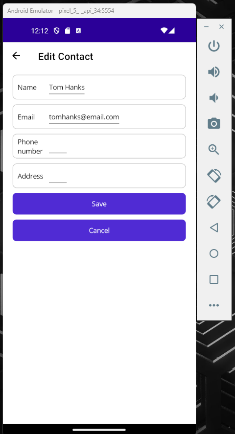

# .NET MAUI Course for Beginners

I wrote this code by following along with the [freeCodeCamp.org .NET Maui tutorial](https://www.youtube.com/watch?v=n3tA3Ku65_8).

## Course Content
- what .NET Maui is / history
- creating the first project & setup
- typical project structure
- three elements of stateful .NET Maui (view -> events -> state -> repeat)
- URI-based navigation/page routing
- basics of listview and data binding
- event handling of a listview
- parameters of URI-based navigation
- work with stack layouts
- using ObservableCollections to notify listviews of data changes
- add validation on input fields
- add a reusable content control
- add ContextActions menu items
- adding a searchbar

## Screenshots

<b>The contacts list view:</b>

<b>The search for a contact view:</b>

<b>The right click menu:</b>

<b>The edit a contact view: (add the contact view reuses the same layout)</b>

<b>An example of validation on the edit/add contact views:</b>

last updated 23/05/2024
